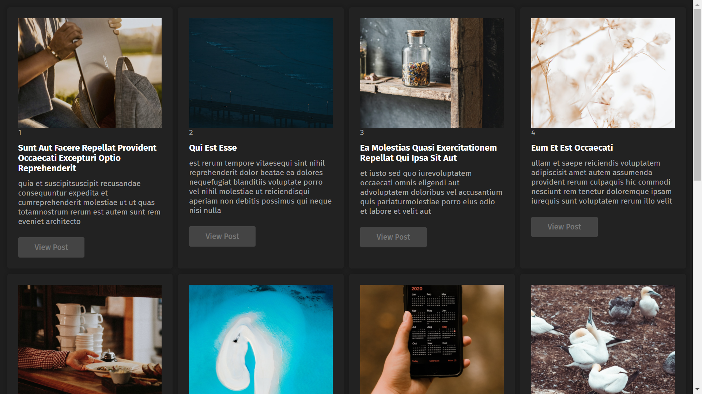
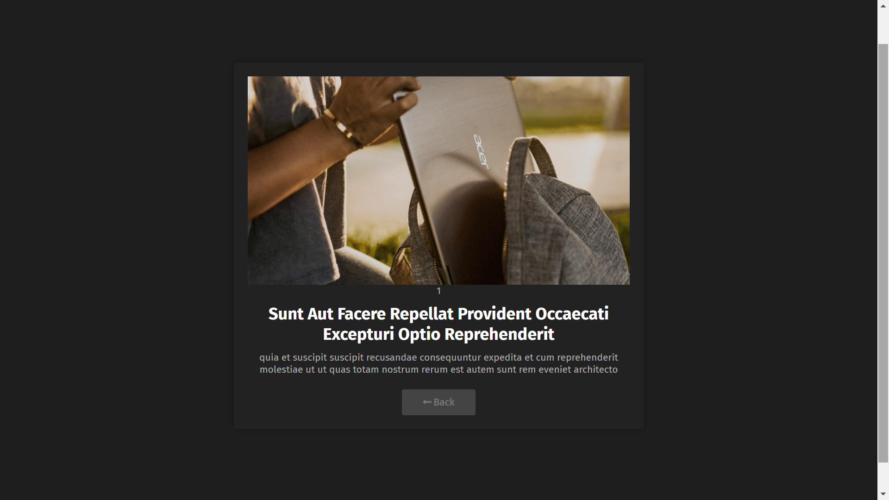
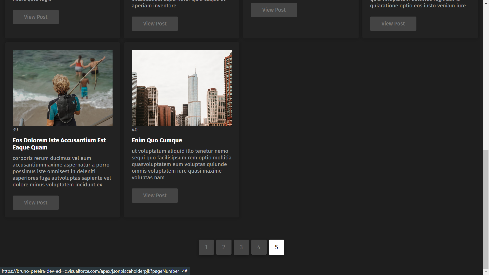

# JSONPlaceholderUnsplashPjk
Salesforce project using the JSON Placeholder and Unsplash APIs. Built using Apex and Visualforce.

### What is
This project is a grid of posts fetched from the [JSON Placeholder API](https://jsonplaceholder.typicode.com). All the posts have an image cover that is fetched from the [Unsplash API](https://unsplash.com/documentation) using public authentication (i.e. only passing an access key as parameter to the request does the job, meaning there's no user specific authentication). When viewing the grid of posts, it's possible to click a button and view a specific post on a different page. It also features pagination.

### Features
- Fetching data from 2 different APIs
- Fully responsive CSS grid layout (pure CSS, no bootstrap or anything)
- A button on every post on the grid allows viewing the specific post on a different page
- Pagination with 10 posts per page
- Beautiful "dark mode" design with smooth transitions on animations

### Tech stack
- REST APIs ([JSON Placeholder API](https://jsonplaceholder.typicode.com) and [Unsplash API](https://unsplash.com/documentation))
- Built on the Salesforce CRM platform
- Most development was made using Salesforce DX for VS Code
- Apex
- Visualforce
- CSS
- Google Fonts (the font used was 'Fira Sans')
- FontAwesome (for some of the icons)

### Screenshots
#### Post grid

<em>Post grid showing some of the posts on a page. The numbers below the images on each post are the post ids, which i left there mostly for testing purposes. The white, bold text is the post title, and the text below in a darker color is the post description. The "View Post" button leads to the single post page, where it's possible to see only the post you clicked -- the single post page would make more sense if the posts had a bigger description, so i would show a smaller description on the homepage and the bigger on on the single post page. The grid was made using an `apex:pageBlockTable` with data from a custom controller.</em>

##### Visualforce code block used to render the post grid
    <apex:pageBlockTable id="tableBlock" styleClass="tableBlock" value="{!Data}" var="key">
    <apex:column>
        
    </apex:column>
    <apex:column value="{!Data[key].id}" />
    <apex:column styleClass="tableDataTitle" value="{!Data[key].title}" />
    <apex:column value="{!Data[key].body}" />
    <apex:column>
        <apex:form>
            <apex:commandLink styleClass="singlePostBtn" value="View Post" action="{!gotoPage}">
                <apex:param name="postId" value="{!Data[key].id}" assignTo="{!postId}" />
                <apex:param name="postImgUrl" value="{!Data[key].postImage}" assignTo="{!postImgUrl}" />
            </apex:commandLink>
        </apex:form>
    </apex:column>
    </apex:pageBlockTable>
    
##### Apex method used to fetch the images from Unsplash
    public static Map<Object, Object> getImageData() {
    Http http = new Http();
    HttpRequest request = new HttpRequest();
    if (Apexpages.currentPage().getParameters().get('pageNumber') == NULL) {
        request.setEndpoint('https://api.unsplash.com/photos?client_id=59I_rlGU2KQHyoJy6R1_K6gfjiNpuXq8y7uz8UEUbRk&page=1');
    } else {
        request.setEndpoint('https://api.unsplash.com/photos?client_id=59I_rlGU2KQHyoJy6R1_K6gfjiNpuXq8y7uz8UEUbRk&page='+Apexpages.currentPage().getParameters().get('pageNumber'));
    }
    request.setMethod('GET');
    HttpResponse response = http.send(request);
    if (response.getStatusCode() == 200) {
    Map<Object, Object> dataMap = new Map<Object, Object>();
    List<Object> results = (List<Object>)JSON.deserializeUntyped(response.getBody());

    for (Object r : results) {
        Map<String, Object> data = (Map<String, Object>)r;
        dataMap.put(data.get('id'), data.get('urls'));
    }
    System.debug(pageNumber);

    return dataMap;
    } else return null;
    }

##### Apex method used to fetch data from the JSON Placeholder API
    public static Map<Object, Object> getData(){
    Http http = new Http();
        HttpRequest request = new HttpRequest();

        if (Apexpages.currentPage().getParameters().get('pageNumber') == NULL) {
            request.setEndpoint('https://jsonplaceholder.typicode.com/users/1/posts');
        } else {
            request.setEndpoint('https://jsonplaceholder.typicode.com/users/'+Apexpages.currentPage().getParameters().get('pageNumber')+'/posts');
        }

    request.setMethod('GET');
    HttpResponse response = http.send(request);
    if (response.getStatusCode() == 200){
      Map<Object, Object> dataMap = new Map<Object, Object>();
            List<Object> results = (List<Object>)JSON.deserializeUntyped(response.getBody());

            // Get the post's images
            List<String> imageUrls = new List<String>();

      for (Object o : getImageData().values()) {
                Map<String, Object> imgUrl = (Map<String, Object>)o;
                imageUrls.add((String)imgUrl.get('regular'));
            }

            Integer counter = 0;
      for (Object r : results){
        Map<String, Object> data = (Map<String, Object>)r;
        String postBodyJSON = '{"id":"' + data.get('id')+'", "title":"' + data.get('title')+'", "body":"' + data.get('body')+'", "postImage":"'+ imageUrls[counter] +'"}';
        Object postBody = JSON.deserializeUntyped(postBodyJSON.replaceAll('\n', '').replaceAll('\r', ''));
                dataMap.put(data.get('id'), postBody);

                counter++;
            }

      return dataMap;
    } else return null;
    }

#### Single post page

<em>The idea of the single post page is to view the post in more detail. Since this was a small project, i didn't include different post elements in the single post page. The "Back" button leads to the homepage. The single post page uses parameters passed from the homepage to fetch specific data from JSON placeholder and Unsplash.</em>

##### Visualforce code block used to render the specific post
    <apex:pageBlockTable styleclass="tableBlock" value="{!SingleData}" var="data">
    <apex:column>
      
    </apex:column>
    <apex:column value="{!SingleData[0].id}" />
    <apex:column styleclass="tableDataTitle" value="{!SingleData[0].title}" />
    <apex:column value="{!SingleData[0].body}" />
    <apex:column>
      <apex:form>
        <apex:commandLink styleClass="singlePostBtn" value="Back" action="{!gotoPageSingle}" />
      </apex:form>
    </apex:column>
    </apex:pageBlockTable>

##### Apex action that is called when the user clicks "View Post" on the homepage
    public PageReference gotoPage(){
      PageReference pr = Page.JSONPlaceholderPjkSingle;
      pr.getParameters().put('postId', this.postId);
          pr.getParameters().put('postImgUrl', this.postImgUrl);

      pr.setRedirect(true);
      return pr;
    }

<em>Notice it's passing the post id and the cover image URL as parameters. This data is used to fetch a specific post and image.</em>

##### Custom controller used on the single post page
    public List<Object> getSingleData(){
      Http http = new Http();
      HttpRequest request = new HttpRequest();
      request.setEndpoint('https://jsonplaceholder.typicode.com/posts?id=' + Apexpages.currentPage().getParameters().get('postId'));
      request.setMethod('GET');
      HttpResponse response = http.send(request);
      if (response.getStatusCode() == 200){
        List<Object> results = (List<Object>)JSON.deserializeUntyped(response.getBody());
        return results;
      } else{
        return null;
      }
    }

#### Pagination

<em>The homepage features pagination. Each page has 10 posts.</em>

##### Visualforce code block used on the pagination
    <apex:form styleclass="paginationContainer">
    <apex:commandLink action="{!nextPage}" value="1" reRender="tableBlock" styleclass="pageNumber">
        <apex:param name="pageNumber" value="1" assignTo="{!pageNumber}" />
    </apex:commandLink>
    <apex:commandLink action="{!nextPage}" value="2" reRender="tableBlock" styleclass="pageNumber">
        <apex:param name="pageNumber" value="2" assignTo="{!pageNumber}" />
    </apex:commandLink>
    <apex:commandLink action="{!nextPage}" value="3" reRender="tableBlock" styleclass="pageNumber">
        <apex:param name="pageNumber" value="3" assignTo="{!pageNumber}" />
    </apex:commandLink>
    <apex:commandLink action="{!nextPage}" value="4" reRender="tableBlock" styleclass="pageNumber">
        <apex:param name="pageNumber" value="4" assignTo="{!pageNumber}" />
    </apex:commandLink>
    <apex:commandLink action="{!nextPage}" value="5" reRender="tableBlock" styleclass="pageNumber">
        <apex:param name="pageNumber" value="5" assignTo="{!pageNumber}" />
    </apex:commandLink>
    </apex:form>

<em>The `nextpage` action links to the homepage, but passing a pageNumber parameter, which is used by the controller to fetch a different set of posts and images.</em>

##### The nextPage action
    public PageReference nextPage() {
        PageReference pr = Page.JSONPlaceholderPjk;
        pr.getParameters().put('pageNumber', pageNumber);
        pr.setRedirect(true);
        return pr;
    }

##### When accessing the homepage without parameters, the page number defaults to 1
    public JSONPlaceholderUnsplashPjk () {
        pageNumber = '1';
    }

### What could have been done better
Being totally honest, a lot of things could have been done in a more optimal way here. **Just to name a few mistakes**:

- Too much repeated code (i don't really need two different controllers for the grid and single post pages)
- Afaik i could have rendered the single post alone on the same page (instead of loading a different page)
- CSS should be on a different file
- Afaik i could call a different page (using pagination) without reloading the current one (leading to less requests)
- No tests (since this was a simple, quick project, i didn't write test classes)
